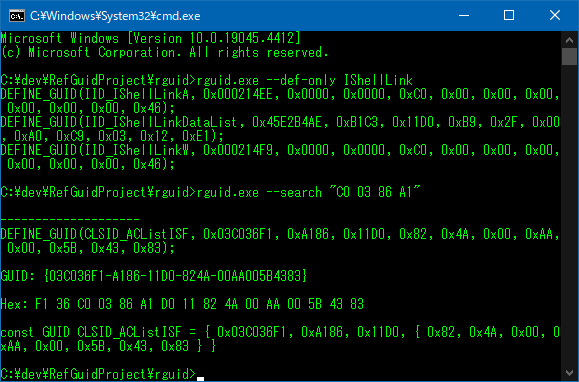

# rguid by katahiromz

This program `rguid` is a command line tool for Win32, to search, convert, and/or generate GUIDs.

## Usage

```txt
rguid --search "STRING"
rguid IID_IDeskBand
rguid "{EB0FE172-1A3A-11D0-89B3-00A0C90A90AC}"
rguid "72 E1 0F EB 3A 1A D0 11 89 B3 00 A0 C9 0A 90 AC"
rguid "{ 0xEB0FE172, 0x1A3A, 0x11D0, { 0x89, 0xB3, 0x00, 0xA0, 0xC9, 0x0A, 0x90, 0xAC } }"
rguid "DEFINE_GUID(IID_IDeskBand, 0xEB0FE172, 0x1A3A, 0x11D0, 0x89, 0xB3, 0x00, 0xA0, 0xC9, 0x0A, 0x90, 0xAC);"
rguid --list
rguid --generate NUMBER
rguid --scan "YOUR_FILE_1" "YOUR_FILE_2" ...
rguid --help
rguid --version
```

You can specify partial GUIDs and multiple GUIDs.

## Screenshot



## License

- MIT

## Copyright

- Copyright © 2024 Katayama Hirofumi MZ.
